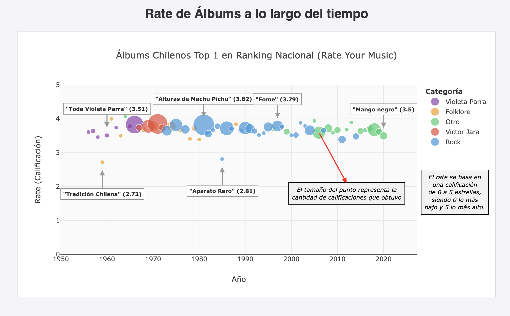

# Proyecto 12 - Top Musica Chilena

Proyecto semestral para Visualización de la Información (IIC2026)

## Link GitHub Pages

https://mmaartinn.github.io/Proyecto-InfoVis/

## Entrega 1 (Visualización Estática)

## Entrega 2 (Visualización Dinámica)

Se añadieron funcionalidades:
* Reproducción de música para cada álbum

Se corrigió:
* Simplificación de información (coherencia con historia que se quiere contar)

<!-- ![Foto][E2.png] --->
